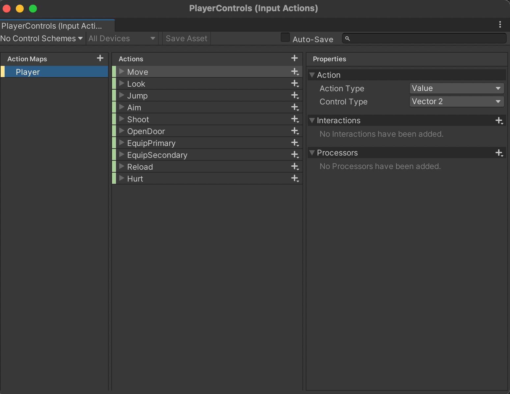

# **Un juego de plataformas**


Dejo [aquí](https://www.youtube.com/watch?v=0_eygUsUKrI) el enlace al vídeo de demostración.


## **Cómo jugar**

<div style="text-align: justify"> 

El juego consta de tres escenas principales por las que navegar durante la partida: menú principal, nivel 1 y pantalla final. En caso de crear un nuevo nivel, sólo hay que añadirlo a la lista y cargarlo una vez se termina el nivel superado. 

- Menú principal: Consta de dos botones para iniciar la partida y para salir de la aplicación. 

- Nivel 1: Correspondiente al primer nivel de juego. Aquí podemos controlar al jugador mediante las flechas del teclado o las teclas **A, S, D y W**. Se permite saltar pulsando la barra espaciadora, recargar el arma pulsando la tecla **R**. Movemos la cámara con el ratón y apretamos el botón derecho para disparar una vez o mantenemos pulsado para disparar continuamente. Se puede apuntar con precisión manteniendo pulsado el botón derecho del ratón.

- Game Over: Se muestra una vez superado el juego y dispone de un botón para volver al menú principal y un botón para cerrar la aplicación.

<p>


</p>

</div>

## **Refactoring**

<div style="text-align: justify"> 

El hecho de haber realizado la práctica anterior de forma reutilizable y escalable ha sido posible reutilizar gran parte de los scripts implementados. Sencillamente se ha tenido que adaptar algunas de las partes para hacerlas coincidir con el tipo de juego en tercera persona.

> ### **Player scripts**
> Incorpora las funcionalidades correspondientes al sistema de estadísticas del jugador, la muestra por pantalla del HUD, el inventario y la gestión de sus objetos (así como el recogerlos), el cambio de armas y la gestión de los disparos.
>
> **1. Sistema de estadísticas:** Tanto para el jugador como para los enemigos, se ha creado una clase genérica llamada **Character Stats** de la cual heredan **Player Stats**, **Enemy Stats** y **Boss Stats**. Las tres clases son idénticas a las implementadas en la práctica anterior. 
>
> **2. HUD:** Consta de cuatro métodos encargados de actualizar la UI del jugador: **UpdateHealth()**, **UpdateShield()**, **UpdateWeaponUI()** y **UpdateAmmoUI()**. También ha sido reaprovechado sin cambios.
> 
> **3. Inventory:** Clase encargada de gestionar el inventario del jugador. Básicamente añade objetos, los elimina y nos permite acceder a ellos desde otras clases mediante el método **GetItem()**. Ésta clase dispone del método **AddItem()**, que comprueba el tipo de objeto que se ha recogido y ejecuta un código u otro en función de ello.
>
> Como sólo podemos almacenar llaves y armas, si el objeto que se recibe por parámetro es una llave se llama a **AddKey()** y se le pasa por parámetro el objeto de tipo **Key**. En caso de ser un arma, se llama a **AddWeapon()** y se le pasa por parámetro el objeto de tipo **Weapon**.
>
> De la misma manera que los dos anteriores, el inventario ha sido reaprovechado en su totalidad.
>
> **4. Equipment Manager:** Lleva el registro del arma que tenemos equipada y nos permite cambiar de una a otra pulsando la tecla adecuada. Además, actualiza el HUD con la información del arma que llevamos al momento de cambiar (icono, munición y almacenaje). 
> 
> Para ello, en el método **Update()** se comprueba si se pulsa la tecla 1 o la tecla 2 para equipar el arma que corresponde; comprobando primero que el arma no esté ya equipada. En caso de no estarlo, se desequipa el arma anterior y se equipa la seleccionada llamando a **EquipWeapon()** y pasando por parámetro el objeto del inventario. Dicha función instancia el arma en cuestión en las manos del jugador y actualiza los datos del HUD. El método **UnequipWeapon()**, sencillamente destruye la instancia anterior. 
>
> Es importante tener en cuenta que sólo se nos permite llevar 2 armas y estas podrán ser de tipo *Primary* o *Secondary* (podrían ser otras). Esto es fácilmente ampliable y se verá más en detalle en el apartado de Items. Nuestro jugador llevará equipada una pistola por defecto nada más empezar la partida. 
>
>En este caso, aunque los métodos estén implementados, no se hace uso de ellos porque no se dispone de más armas a parte de la pistola.
>
> **6. Shooting:** La clase shooting es bastante compleja debido a la cantidad de cosas a gestionar. Dicha clase incluye la funcionalidad de disparo y la de recarga. Para disparar, podemos mantener pulsado el botón derecho del ratón y será el método **Shoot()** el encargado de gestionar el fire rate en función del arma equipada. Por otro lado, para recargar basta con pulsar la tecla **R** y se llama al método **Reload()**. 
>
>El refactor de esta clase ha sido el siguiente:
>   1. `public void StartAim{} y public void CancelAim{}:` Añaden peso a los Riglayers asociados a la posición del arma. Cambia ligeramente la ubicación de las manos y la pistola cuando apuntamos y cuando no.
>
>   2. `private void RaycastShoot(Weapon currentWeapon){}:` Ya no lanzamos un rayo desde el centro de la cámara hacia adelante. En este caso, calculamos un rayo partiendo desde el barrel de la pistola y lo enfocamos hacia la supuesta retícula. Para ello se coloca un target en el forward de la cámara que simula estar ubicado donde estamos apuntando.
>
>   1. `public void ShootAnim{} y public void EnemyHitAnim{}:` Añaden peso a los layers del animator que sólo se ejecutan en la parte superior del cuerpo. 
>

> ### **Enemy scripts**
> 
> Este apartado incluye información sobre la máquina de estados de los enemigos y su sistema de estadísiticas. Para ello, se ha hecho uso de la interfaz **IEnemyState**, ademas de los scripts correspondientes a cada uno de los estados y el manager, y de la herencia de **CharacterStats** para la implementación de **EnemyStats**. 
>
> - **EnemyStats**: Hereda de **CharacterStats** y sobrescribe un par de sus métodos: **CheckHealth** y **Die**. En el caso del primero, sencillamente actualiza la UI. Para el segundo, lanza un trigger de animación de muerte para el animator. Además, se encarga de de llamar a la función **DropLoot()** que forma parte de **LootableObj** y permitirá que suelten objetos con cierta probabilidad. Por último, destruye el objeto e instancia una explosión. También dispone de algunos métodos adicionales:
>
>
>   El script está prácticamente reutilizado con las añadiduras del animator. Además incluye el método **DestroyEnemy()** que se lanza desde un animation event para destruir el enemigo una vez se ha terminado la animación de muerte.
>
> - **FSM:** Máquina de estados que determina el comportamiento de los enemigos durante el juego. Se conforma de los siguientes scripts:
>
>   1. `IEnemyState:` Interfaz que define las funciones que deben implementar las clases que hereden de ella.
>
>   2. `EnemyAI:` Encargado de gestionar el estado actual. Se crea una instancia de esta clase en cada uno de los estados para saber en todo momento en qué punto de la máquina de estados nos encontramos. 
>
>   3. `WanderState:` A diferencia de la entrega anterior, en vez de un patrolling se ha implementado un wander para que los enemigos se muevan hacia puntos generados aleatoriamente dentro de un radio determinado. De igual manera a la práctica 2, dispone de métodos de trigger para la detección del jugador. Permite pasar a los estados **Alert** y **Attack** si detecta al jugador o recibe un disparo, respectivamente.
>
>   3. `AlertState:` Al entrar en estado de alerta, en el **Update()** se hace rotar al enemigo simulando una búsqueda del jugador. Si en el transcurso de la vuelta no se le ha detectado, volverá al wander. En caso de que se detecte al jugador mediante raycasting, pasará al estado **Attack**.
>
>   1. `AttackState:` Estado al que se entra si el enemigo recibe un disparo o detecta al jugador tras el estado de alerta. Se han implementado algunos cambios con respecto al estado de attack de la práctica anterior. En esta, los zombies esperan 1 segundo entre ataque y ataque y sólo nos atacarán cuando están lo suficientemente cerca. De lo contrario, nos perseguirán hasta que salgamos de su radio de acción.
>
>   La máquina de estados de esta práctica incluye todo el código correspondiente a las animaciones que se deben lanzar en cada uno de los estados según convenga. En concreto, no he logrado solucionar un problema con la animación "Scream". Esta animación se lanza cada vez que se detecta al jugador y es previa al FollowTarget. Sin embargo, la necesidad de llamar a FollowTarget en el Update() rompe el animation events. Esto provoca que el zombie se empiece a mover antes de que termine la animación.
>
>   Para solventarlo, se me ha ocurrido que sería posible bindear una corutina desde el controlador de la máquina de estados y así evitar instanciar monobehaviors y provocar runtime errors. No he podido probarlo por falta de tiempo.
>

> ### **UI**
> Esta parte del código es muy sencilla y está 100% reaprovechada de la práctica anterior. Por un lado, se encarga de gestionar las barras de salud y escudo de enemigos y jugador mediante el script **ProgressBar**. Dicha clase contiene dos métodos principales **SetValues()** y **CalcFillAmount()**:
>
> Estos métodos reciben los valores correspondientes a los textos y la cantidad de fill de las imagenes de la UI. 
>
> Por otro lado, existe la clase **InventoryUI** cuyo métodos son **UpdateInfo()** y **UpdateAmmoUI()**. Ambas se encargan de gestionar de un modo u otro la información de los iconos y la munición mostrada por pantalla.
>

> ### **GameIssues**
>Este apartado incluye varios aspectos del juego que se han ido comentando por encima en el resto de apartados. Además, también contiene scripts de gestión de la partida como el **GameManager**. Vayamos primero a los scripts sueltos y, a posteriori, vemos el resto por apartados:
>
> - **GameManager:** Se considera que se ha terminado el nivel (en este caso el juego) una vez eliminado el boss de la zona. Si la salud total del boss llega a 0, se llama a **EndGame()** y se carga la pantalla final (o el siguiente nivel en caso de haberlo).
>
> - **Doors**: El mapa escogido para la práctica tenian de serie implementado un script para abrir puertas. Dichos scripts dependian de un bool **IsLocked** para determinar si la puerta se podía o no abrir. Este script se ha duplicado y se ha creado uno nuevo para la puerta del boss. Este se encarga de asegurarse que **IsLocked** nunca va a ser false mientras no tengamos la llave adecuada. Es decir, que sin llave no podemos abrir la puerta.
>
> - **Menus:** Hay varios scripts que gestionan los menús de juego. La mayoría de ellos son sencillos, como el menú principal o la pantalla final. Sencillamente constan de varios listeners para cada botón que cargan la escena adecuada o cierran la aplicación. Dichos scripts han sido reaprovechados de la práctica anterior con algunas modificaciones en los métodos de los listeners.
>
> - **Items:** Para la creción de objetos almacenables en el inventario se ha reutilizado el sistema implementado en la práctica anterior y se han utilizado Scriptable Objects. Básicamente, tenemos una clase **Item** que hereda de **ScriptableObject** y que contiene un string con el nombre del item y un Sprite con el icono. Partiendo de aquí, se crean dos clases que heredan de esta llamadas **Weapon** y **Key**. 
>
>   Cada una de ellas contiene las propiedades que debe tener cada uno de los objetos y facilita mucho la creación de nuevos. De esta forma, si quisieramos añadir un arma o una llave, sencillamente crearíamos un nuevo scriptable object y le asignaríamos los valores correspondientes. 
>
>   Estos scriptable objects son justamente los mencionados en el apartado **PlayerScripts** cuando tratamos con items de tipo **Weapon** o tipo **Key**.
>
> - **Supplies:** De la misma forma que se hizo en la práctica anterior, se ha usado la interfaz **ISupply** para definir un método común en todos los tipos de consumibles que nos permita recogerlos del suelo. Dicho método se llama **PickupSupply** y, además de heredar de la interfaz, también hereda de **MonoBehaviour** para hacer uso de los métodos **Update** y **Start**. 
>
>   El refactor realizado a estas clases hace uso de **OnTriggerEnter()** para detectar cuando el jugador ha pasado por encima de uno de estos objetos. En el caso de que sea posible aplicar la mejora, se hará. Sino, el objeto quedará en el suelo.
>
> - **Drops:** Por último, también reaprovechado, gestionamos los drops de los enemigos. Para ello, se hace uso de la clase **LootTable**, que hereda de **ScriptableObject** y que contiene un struct con la rareza del objeto y el objeto en cuestión.
>
>   ````
>   [CreateAssetMenu(fileName = "LootData", menuName = "Loot Table")]
>   public class LootTable : ScriptableObject
>   { 
>       [System.Serializable]
>       public struct Probabilities
>       {
>           public int rarity;
>           public GameObject reward;
>       }
>   
>       public Probabilities[] probabilities; 
>       
>   }
>   ````
>
>   Después, disponemos de un script **LootSystem** que se encarga de gestionar los drops. Para ello se hace uso de un comparador de rarezas, que ordena el array de probabilidades para asegurarnos que siempre va de mayor a menor. Por último, se usa el método **SpawnLoot()**, que recibe por parámetro el punto donde se va a soltar el objeto, un factor que ayuda a que los objetos raros salgan con más facilidad, la cantidad de items a soltar y la probabilidad de drop. 
>
>   Así pues, mediante nuestra **LootTable** y el array de probabilidades, generamos aleatoriamente la probabilidad de soltar un objeto y la comparamos con el parámetro de entrada del método para determinar si hay o no que soltarlo. En caso afirmativo, recorremos el array de probabilidades y comprobamos las rarezas para decidir cuál es el objeto seleccinado a instanciar. Una vez se ha soltado el objeto, salimos del loop para asegurarnos que sólo se suelta 1 objeto por enemigo. 
>
>   Para terminar, se hace uso del script **LootableObj** con la intención de añadirlo a los enemigos, cofres o cualquier elemento que pueda soltar objetos. Dicho script, llama al método **SpawnLoot()** de nuestro **LootSystem**.


## **Añadidos**

<div style="text-align: justify"> 
A continuación se detallan los scripts añadidos a esta tercera práctica, más allá de los refactors realizados.

   
### **Camera scripts**
Se trata de dos scripts sencillos que gestionan el movimiento de cámaras y el crosshair de la escena.

   1. `Crosshair Target:` Se usa para ubicar el punto de choque del nuestros disparos justo en el punto en el que se produce una colisión detectada por raycasting. 

   2. `Switch VCam:` Se encarga de dar más o menos peso a las dos cámaras virtuales que hay en la escena. Mientras se apriete el botón derecho del ratón se le dará prioridad a la cámara de apuntar (más cercana al jugador). De lo contrario, se mostrará la cámara de juego normal.
>
<p>


</div>
</p>

### **Boss scripts**
Scripts encargados de controlar la mecánica principal del boss. 

1. `Boss:` Clase cuyo método principal **BossBehavior** se encarga de gestionar los diferentes estados de la pelea mediante un switch case. Para ello, se comprueba que la distancia al jugador sea menor a cierto límite y, sólo entonces, empieza a actuar la máquina de estados. 

    Durante la primera parte del combate sólo alternará entre el lanzallamas y los ataques a melee básicos, así como el andar y el correr hacia el jugador.
       
    La segunda fase incluye un ataque en salto y un ataque mágico extra. 

    ```
    switch (routine)
    {
        case 0:
            // Walk
            animator.SetBool("Walk", true);
            animator.SetBool("Run", false);
            MoveToPlayer(rotation, walkSpeed);

            timer += 1 * Time.deltaTime;
            if(timer > routineTimer)
            {
                routine = Random.Range(0, 5);
                timer = 0;
            }

            break;

        case 1:
            // Run
            animator.SetBool("Walk", false);
            animator.SetBool("Run", true);
            MoveToPlayer(rotation, runSpeed);
            break;

        case 2:
            // Flamethrow
            SetAnimatorForAttack(flameThrowerSkill);
            transform.rotation = Quaternion.RotateTowards(transform.rotation, rotation, 2);
            bossArea.GetComponent<CapsuleCollider>().enabled = false;
            break;

        case 3:
            //Jump Attack
            if(phase == 2)
            {
                jumpDist += 1 * Time.deltaTime;
                SetAnimatorForAttack(jumpAttackSkill);
                collSelect = 3;
                bossArea.GetComponent<CapsuleCollider>().enabled = false;

                if (dirSkill)
                {
                    if(jumpDist < 1)
                    {
                        transform.rotation = Quaternion.RotateTowards(transform.rotation, rotation, 2);
                    }

                    transform.Translate(Vector3.forward * jumpSpeed * Time.deltaTime);
                }
            }
            else
            {
                routine = 0;
                timer = 0;
            }
            break;

        case 4:
            // Fireball
            if(phase == 2)
            {
                SetAnimatorForAttack(fireballSkill);
                bossArea.GetComponent<CapsuleCollider>().enabled = false;
                transform.rotation = Quaternion.RotateTowards(transform.rotation, rotation, 0.5f);
            }
            else
            {
                routine = 0;
                timer = 0;
            }
            break;
    }
    ```
    Dicho script también incluye varios métodos que se llaman durante las animaciones de ataque mediante eventos para asegurarnos que se ejecutan ciertas acciones. Entre ellos están:

    - `EnableAttackDir & DisableAttackDir`: Gestionan la dirección de salto del ataque con salto.

    - `EnableHitCollider & DisableHitCollider`: Activan y desactivan los colliders que actuan como trigger para dañar al jugador.

    - `StartFire & StopFire`: Activan y desactivan el bool flameThrower para determinar cuándo lanzar el sistema de particulas de la llamarada. 

    - `FireballSkill`: Determina cuántas bolas de fuego se van a lanzar con el ataque mágico. Hay que llamarlo tantas veces como bolas se quiera instanciar en el animator event.

    - `EndAnimations`: Se llama al final de cada animación de ataque para determinar cuándo se ha acabado y se puede pasar a otro. 

    Además de los animation events, existe el método **BossAlive()**. Este método determina cuánta vida le queda al boss para cambiar de fase. Si la vida se ha reducido a menos de la mitad, pasaremos a la fase 2 del combate. En **Update()**, mientras el boss siga con vida, se llamara a este método. De lo contrario, marcamos el boss como derrotado para pasar a la siguiente ronda.


2. `Boss Area:` Selecciona los colliders que se deberán activar para cada ataque con un switch case y determina los floats del blend tree de los ataques. 

            switch (melee)
            {
                case 0:
                    // Attack 1
                    animator.SetFloat("Skills", 0);
                    boss.collSelect = 0;
                    break;
                case 1:
                    //Attack 2
                    animator.SetFloat("Skills", 0.2f);
                    boss.collSelect = 1;
                    break;
                case 2:
                    // Jump
                    animator.SetFloat("Skills", 0.4f);
                    boss.collSelect = 2;
                    break;
                case 3:
                    // Fireball
                    if (boss.phase == 2)
                    {
                        animator.SetFloat("Skills", 1);
                    }
                    else
                    {
                        melee = 0;
                    }
                    break;
            }

2. `Boss Hit:` Aplica daño si los triggers de los ataques colisionan con el jugador.
    ```
    private void OnTriggerEnter(Collider other)
    {
        if (other.CompareTag("Player"))
        {
            if (!other.GetComponent<PlayerStats>().isDead)
            {
                boss.bossStats.DealDamage(boss.target.GetComponent<PlayerStats>(), damage);
            }
        }
    }
    ```
    <p> 
    
    </p>


3. `Fireball y Flamethrow`: Lanza bolas que actúan como triggers para dañar al jugador con los ataques mágicos. En el caso de las bolas de fuego, disponen de un renderer para hacerlas visibles con una textura de lava. Para la llamarada, el prefab no tiene render porque se ejecuta un sistema de partículas. 

4. `Boss Stats`: Encargado de gestionar las estadísticas del boss de la misma manera que **PlayerStats** o **Enemy Stats**. Hereda de **Character Stats**.


### **Player Controller**

Para esta práctica, en vez de hacer uso del script Third Person Controller, se ha implementado uno propio. Sencillanmente controla el movimiento y las animaciones, así como la rotación del personaje principal.

A diferencia de otras implementaciones hechas hasta el momento, en esta PEC he hecho uso del nuevo input system de Unity. Así pues, las acciones a realizar se han mapeado generado un PlayerInput desde el editor y se accede de forma ligeramente distinta mediante código.

<p>

</p>

## **Animaciones**

Todas las animaciones y los modelos han sido descargados de Mixamo. A contuación, adjunto capturas de los animators del jugador y los enemigos. 


**Player:**
<p>


</p>

El base layer se encarga de controlar el blendtree de las direcciones de movimiento del jugador, así como el salto y la animación de muerte.

En el caso de los otros dos layers, sólo lanzan las animaciones en la parte superior del cuerpo usando un Avatar Mask para evitar desperfectos en las animaciones de caminar mientras se ejecuta cualquiera de las otras dos.


**Enemy**:

<p>


</p>

En el caso de los enemigos, el HitLayer también nos servirá para lanzar la animación sólo en la parte superior del cuerpo. 

El base layer gestiona el resto de animaciones que se irán lanzando mediante el uso de la máquina de estados explicada en apartados anteriores.


**Boss**:

<p>


</p>

Para el boss se usa un único layer. Se alterna entre las animaciones de correr y caminar y el blendtree que los distintos ataques. Como ya se ha explicado anteriormente, las animaciones de los ataques se lanzan modificando los floats del blend tree según determine la máquina de estados. 


## **Rigging**

Para el arma adjunta al jugador, se ha usado rigging para determinar las distintas posiciones que ésta puede soportar. También se ha mejorado al posición de las manos para sujetarla, así como la posición de la espina y la cabeza cuando apuntamos arriba o abajo. 

<p>

</p>

## **Comentarios**

Debido a ciertos asuntos personales sólo he dispuesto de una semana para la realización de la práctica. Hay ciertos bugs en el juego que me hubiera gustado solucionar y que no me ha sido posible por falta de tiempo. Aún así, el resultado de la práctica es bastante positivo para la situación en concreto. 

A pesar de ello, considero que he encaminado los proyectos anteriores de la forma correcta. El hecho de haber podido reutilizar gran parte de los scripts implementados para la práctica anterior, ponen en valor varios de los principios de programación SOLID. Considero de gran importancia el poder hacer código eficiente, reutilizable y bien estructurado.